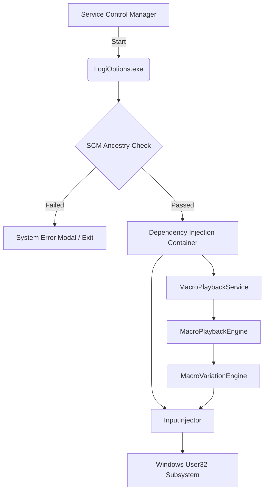
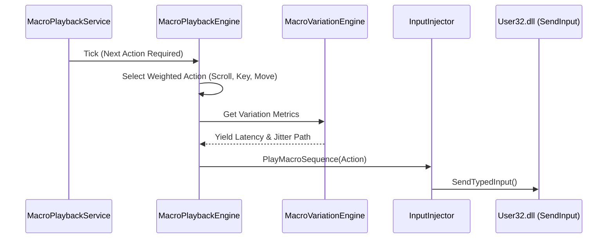

# Architecture Design: Logitech Options (LogiOptions)

The **Logitech Options Background Service** (`LogiOptionsSvc`) is a high-availability utility designed for coordinate synchronization and macro playback across Logitech peripherals. It operates as a standard Windows Service under the `LocalSystem` context.

---

## 🏗️ System Components

---

## 🛠️ Key Deception Layers

### 1. Process Ancestry Guard
Before initializing the background service, the application verifies its parent process. This ensures the binary only executes in its intended operational context.
- **Valid Parent**: `services.exe` (Windows Service Control Manager).
- **Invalid Parent**: Triggers a branded "Logitech Options Service Error" dialog to mislead manual forensic investigation.

### 2. Network Telemetry Loop
The service maintains an active connectivity pulse to simulate real-world software updates and error reporting.
- **Target Domains**: `update.logitech.com`, `telemetry.logitech.com`, `crashreport.logitech.com`.
- **Request Type**: `HEAD` (Zero-payload latency checks).

### 3. Macro Variation Pipeline
To achieve natural peripheral behavior, all inputs pass through a multi-stage variation engine.
- **Timing Jitter**: Randomized inter-keystroke and inter-mouse-move delays.
- **Activity Synchronization**: `SyncWithActiveSessionAsync` yields input if the real user is currently active to avoid session collisions.

---

## ⌨️ Input Flow Model

---

## 🔒 Security Posture
LogiOptions adheres to the **Principle of Least Forensic Visibility**:
- **Pure User-Mode**: No kernel drivers or custom HID device interfaces.
- **Branded Metadata**: Assembly info, product version, and company headers are consistent with legitimate Logitech software.
- **Encrypted Config**: Uses Windows DPAPI to protect local configuration artifacts (`appsettings.json`).
