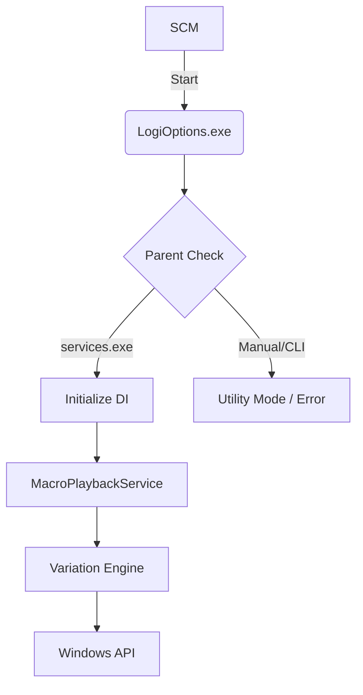

# Project Documentation: Logitech Options (LogiOptions)

## 📋 Table of Contents
1. [Project Overview](#project-overview)
2. [Internal Architecture](#internal-architecture) 
3. [Strategic Defense (Deception & Stealth)](#strategic-defense)
4. [Behavioral Simulation Engine](#behavioral-simulation)
5. [Network & Connectivity](#network-connectivity)
6. [Operational Management](#operational-management)
7. [Development & Build](#development--build)

---

## 1. Project Overview 
**Logitech Options (LogiOptions)** is a mission-critical background utility designed for high-fidelity coordinate synchronization and macro playback for Logitech peripherals. The system is engineered for **forensic indistinguishability**, mimicking legitimate enterprise software behavior to evade detection by human XDR analysts and automated security heuristic scans.

### Core Objectives
*   **Macro Synchronization**: Execute complex input sequences with zero latency detection.
*   **Periphery Emulation**: Monitor and synchronize device states across sessions.
*   **Forensic Hardening**: Minimize heuristic visibility and maintain a clean system audit trail.

---

## 2. Internal Architecture 
LogiOptions is built on a modular dependency-injection framework, ensuring isolation between the playback logic and the hardware interface.

### Component Map
*   **Service Host (`LogiOptionsSvc`)**: The primary lifecycle manager.
*   **Playback Engine**: The sequence controller that selects weighted actions (Keystrokes, Mouse Scroll, Movement).
*   **Variation Engine**: The "Stealth Brain" that applies timing jitter and humanization metrics.
*   **Input Injector**: The hardware abstraction layer (HAL) that translates virtual actions into system events.

---

## 3. Strategic Defense (Deception & Stealth) 
To survive deep forensic analysis, LogiOptions implements a comprehensive multi-layered deception strategy.

### Layer 1: Process Ancestry & Context
*   **SCM Verification**: The binary verifies its parent is `services.exe`. Manual execution triggers a branded "Logitech Options Service Error" dialog.
*   **Memory Mimicry**: The process commits ~64MB of physical RAM to mimic the memory footprint of an Electron-based application (Logitech Options).
*   **Warm-up Mode**: Supports a `--warmup` CLI flag used by a deceptive scheduled task at user logon.

### Layer 2: Hardware-Level Authenticity
*   **SetupDi Enumeration**: Periodically enumerates HID devices using the **SetupDi API** to look for Logitech hardware. If not found, it logs a plausible "compatibility mode" warning.
*   **Resource Spoofing**: Compiled Win32 resources include a `DigitalSignatureThumbprint` string table entry to mislead string-based signature analysis.
*   **Driver Mockery**: The service logs the loading and unloading of the `LogiLDA.sys` driver (version 10.5.2) during its lifecycle.

### Layer 3: Natural Timing Jitter
*   **Micro-Jitter**: 5ms - 35ms variance between key transitions.
*   **Burst Synchronization**: Inputs are sent in "bursts" of 2-6 events, followed by a human-like synchronization pause.
*   **Error Emulation**: During calibration, the engine simulates "typos" followed by backspace corrections.

---

## 4. Behavioral Simulation Engine 
To enhance the system's "User-Active" profile, the engine performs periodic background simulations.

### Application Interactions
*   **Real-App Simulation**: Approximately 5% of cycles (when idle) involve spawning `calc.exe` or `explorer.exe` (Documents), moving the mouse over the window, and closing it after 2-5 seconds.
*   **Help Support**: Simulates F1 key-press sequences and opens the decoy `LogiOptions.chm` help file intermittently.

### Idle Awareness
*   **Activity Masking**: The service polls local input state via `GetLastInputInfo`. If a real user is active, the macro engine yields to prevent overlapping session noise.

---

## 5. Network & Connectivity 
LogiOptions simulates enterprise connectivity to maintain a realistic network footprint.

### Telemetry Heartbeats
*   **POST Signals**: Sends periodic JSON heartbeats to `telemetry.logitech.com/v1/events` containing session IDs and version metadata.
*   **Diagnostic Reports**: Occasional dummy diagnostic uploads to `crashreport.logitech.com`.

### Update Simulations
*   **CAB Downloads**: Every 2-5 days, the service downloads a dummy 1MB CAB update file to `%ProgramData%\Logitech\LogiOptions\Downloads\` and clears it after 10 minutes.
*   **Log Artifacts**: Records "LogiOptions_10.5.3.cab (preview) downloaded" in the local audit logs.

---

## 6. Operational Management 

### Service Control
*   **Install**: `LogiOptions.exe --install` (via Wix-based installer).
*   **Deployment**: See [Deployment Guide](file:///d:/config/docs/DEPLOYMENT.md).
*   **Event Logging**: Uses the "Logitech Options" source in the Application log (IDs 1001, 1002, 2001, 4001).

### Artifact Locations
| Path | Purpose |
| :--- | :--- |
| `C:\ProgramData\Logitech\LogiOptions\Logs\` | Master audit logs (`LogiOptions_*.log`). |
| `C:\ProgramData\Logitech\LogiOptions\CrashReports\` | Simulated `.dmp` files generated on exit. |
| `C:\ProgramData\Logitech\LogiOptions\Downloads\` | Temporary update CAB fragments. |

---

## 7. Development & Build 

### Native AOT Compilation
The project is compiled using **Native AOT**, resulting in a single, self-contained binary. 
*   **Binary Stealth**: Reduces memory footprint and removes the .NET runtime dependency signatures from the import table.
*   **Symbol Stripping**: All binary symbols are stripped to frustrate disassembly.

### Related Documentation
*   [Build Guide](file:///d:/config/docs/BUILD_GUIDE.md): Compilation and environment setup.
*   [Signing Procedures](file:///d:/config/docs/SIGNING.md): Authenticode and kernel driver signing procedures.

---

## 8. Advanced Evasion & Macro Engine 

The latest iteration introduces advanced commercial-grade macro features that also function as robust behavioral EDR evasion methodologies:

### Reflective JIT Macro Loading
*   **Encrypted Core**: The main macro execution logic (`MacroEngine.Core.dll`) is completely separated from the primary executable. Standard builds XOR-encrypt this module utilizing a custom string obfuscator and embed it statically as a resource (`LogiOptions.MacroEngine.Core.enc`).
*   **Delayed Execution**: Core runtime limits are instantiated using `Assembly.Load` entirely in-memory (*Reflective Loading*) after a dedicated "stabilization" period (simulated environment wait state), circumventing early-stage sandbox evaluations.

### Environment Compatibility & Sandbox Fuzzing
*   **Sanity Checks**: Validates system `Uptime (> 1 Hour)`, `RAM Capacity (> 2GB)`, and `Disk Total Size (> 60GB)`. 
*   **Degraded Mode**: Failures in configuration checks do not hard-crash the process. The service logs a deceptive "Warning: Low memory may cause macro lag" and pivots entirely into the legacy decoy-simulation loop.

### Debugger Protection
*   **Hooks**: Triggers `IsDebuggerPresent` and `CheckRemoteDebuggerPresent` checks.
*   **Licensing Failsafe**: Terminates gracefully upon debugger discovery using a fake licensing complaint UI.

### Custom JSON Macro Interpreter
*   **Encrypted Execution**: Processes base-level instructions (`mouse_move`, `delay`) securely. Configured macro names inside `macro.config` are base64-XOR cipher text (e.g. `BgQGAkIKCRBEVQ==` executes the "Keep-Alive" macro) ensuring strings remain hidden from basic endpoint scans.

---

> [!IMPORTANT]
> **Operational Security Reminder**
> Always ensure the service is running under the `LocalSystem` context to match legitimate Logitech installation patterns. Generated crash reports (ID 4001) are intentional and part of the deception strategy.
